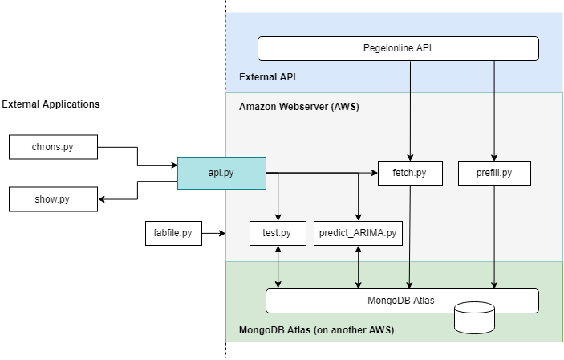

# Water level prediction at Elbe river: An API-centric data science product
This project is to demonstrate a working data science product using methods such as
modularization, data gathering through apis, continuous re-training of ML model, publishing
and visualizing via an API - all hosted on AWS. 
### Idea
The main idea is to build everything around an API, and use that API for 
(A) controlling/triggering main fuctions such as unpdating the database, re-training the 
machine learning model and... 
(B) ...making data and results available through jsons. 
As a result, any theoretical application accross all devices can make use of 
this data science product - as long it is connected to the web!
### Examplary application
A simple dashboard that shows real values as well as the most recent predictions 
http://ec2-18-197-132-108.eu-central-1.compute.amazonaws.com:8080/show
# Architecture

### Used tech:
- AWS
- MongoDB Atlas
- Python
- pymongo
- Flask
- pyramid ARIMA
- plotly
- requests
- pandas
- fabric
### Scripts
- prefill.py: This script performs the inital prefilling of mongoDB atlas from a given data scource
- fetch.py: Checks and fetches deltas between most recent data on atlas and newest data 
available in original data source
- predict_ARIMA.py: Uses available data on atlas to train a machine learning model (ARIMA) that can predict
future values, then saves them into MongoDB Atlas
- show.py: Creates a nice visualization of the training data as well as predicted values as html document (using plotly)
- api.py: Flask server file, the main API
- test.py: Test scripts for database, API connection
- config.py: Configures database connections
- fabfile.py: Fabric script that setups AWS
# Installation
### AWS Server setup
local --> do on your local machine 
server --> do on server 
1. local: -git clone https://github.com/mheerens/product-api.git
2. local: -pip install requirements.py
3. local: in folder create credentials.py containing {mongouser}, {mongopass} and a {shutdownpw} (all strings)
4. local: -fab basics (installs python and git on server)
5. server: -git clone https://github.com/mheerens/product-api.git
6. local: -fab requirements (installs python packages)
7. local: -fab credentials (sends credentials.py to server)
8. local: -fab run (starts server, might have to open ports to public first)
9. server: deploy crontabs 
### Crontabs on server:
6,21,36,51 * * * * python3 /home/ec2-user/product-api/chrons.py -do fetch 
0 3 * * * python3 /home/ec2-user/product-api/chrons.py -do predict 
8,23,38,53 * * * * python3 /home/ec2-user/product-api/show.py
